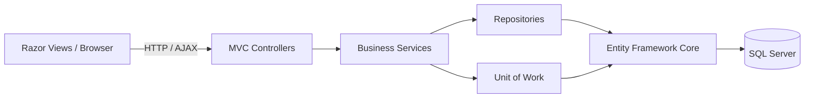
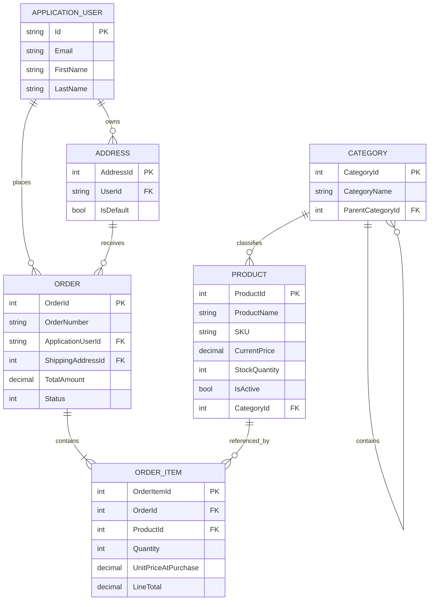

<div align="center">

# ShopHub

### An end-to-end e-commerce application built with ASP.NET Core MVC

Role-based storefront and administration, inventory-aware checkout, session cart management, and a layered data-access architecture.


</div>

---

## Overview

ShopHub is a personal portfolio project that demonstrates how a complete e-commerce workflow can be designed using the MVC pattern in .NET.

The application separates customer and administrator experiences into dedicated MVC Areas, applies role-based authorization at the controller level, and keeps business and persistence logic outside controllers through services, repositories, and a Unit of Work.

This project focuses on the engineering behind a storefront rather than only the visual interface: user-owned data is protected, checkout is transactional, inventory is validated again before an order is committed, and administrative actions are separated from customer purchasing.

## Video walkthrough

> Demo video coming soon. The walkthrough will cover the complete customer journey and the administrator workflow described below.

## Highlights

- Separate **Admin** and **Customer** MVC Areas
- ASP.NET Core Identity authentication with Admin and Customer roles
- Public, read-only storefront for guests and administrators
- Customer-only cart, addresses, checkout, and order history
- Administrator storefront preview without purchase controls
- Responsive Razor views styled with Bootstrap and custom CSS
- AJAX cart operations and AJAX order-status updates
- Repository, Service, and Unit of Work patterns
- Transactional checkout with live stock validation
- SQL Server persistence through Entity Framework Core
- Ownership-scoped queries for customer orders and addresses
- Server-side validation, anti-forgery protection, and secure cookie settings

## Application roles

| Visitor | Storefront access | Purchase access | Management access |
|---|---:|---:|---:|
| Guest | Browse, search, filter, and view product details | Sign-in required | No |
| Customer | Full storefront access | Cart, addresses, checkout, and order history | No |
| Admin | Read-only storefront preview | No | Dashboard, products, categories, orders, admins, and roles |

## Features

### Customer experience

- Customer registration and login
- Product catalog with:
  - active-product filtering
  - keyword and price search
  - category filtering
  - pagination
  - product details and stock indicators
- Session-backed shopping cart
- Add-to-cart, quantity updates, and removal through AJAX
- Server-side inventory checks when cart quantities change
- Multiple shipping-address management
- Default shipping-address selection
- Checkout validation against current database stock
- Transactional order creation and stock deduction
- Order confirmation, history, and customer-owned order details

### Administration

- Dashboard with:
  - product, order, customer, and pending-order totals
  - recent orders
  - active-product count
  - low-stock alerts
- Product CRUD with:
  - generated unique SKUs
  - active/inactive visibility
  - stock management
  - image upload validation
- Parent/child category management
- Order listing with AJAX status updates
- Administrator-account creation
- Identity-role creation, editing, and deletion
- Storefront preview with direct product-management links

## Architecture



### Request responsibilities

| Layer | Responsibility |
|---|---|
| Views | Razor rendering, forms, responsive UI, and client-side interactions |
| Controllers | Routing, authorization, model validation, and HTTP responses |
| Services | Business rules for products, orders, addresses, cart, and checkout |
| Repositories | Entity-specific queries and persistence operations |
| Unit of Work | Coordinated saves and checkout transactions |
| EF Core | Object-relational mapping, relationships, indexes, and migrations |
| SQL Server | Durable application and ASP.NET Identity data |

## Project structure

```text
MiniECommerce/
├── Areas/
│   ├── Admin/
│   │   ├── Controllers/          # Dashboard, product, category, order, role, account
│   │   ├── ViewModels/           # Admin-specific presentation models
│   │   └── Views/                # Protected administration interface
│   └── Customer/
│       ├── Controllers/          # Catalog, cart, checkout, address, order, account
│       ├── ViewModels/           # Catalog, checkout, address, and account models
│       └── Views/                # Storefront and customer account interface
├── Controllers/                  # Public home and error handling
├── Data/
│   └── ApplicationDbContext.cs   # Identity-aware EF Core context
├── DTO/                          # Data-transfer objects
├── Extensions/                   # Session serialization helpers
├── Interfaces/
│   ├── Repositories/             # Repository and Unit of Work contracts
│   └── Services/                 # Business-service contracts
├── Migrations/                   # Entity Framework Core migrations
├── Models/                       # Domain and Identity entities
├── Repositories/                 # Generic and entity-specific repositories
├── Results/                      # Business-operation result types
├── Services/                     # Application business logic
├── Views/                        # Shared/public Razor views
├── wwwroot/
│   ├── css/                      # Area and page-specific styling
│   ├── js/                       # Client-side behavior
│   └── Images/                   # Uploaded product images
├── Program.cs                    # Dependency injection and middleware pipeline
└── MiniECommerce.csproj
```

## Technology stack

| Category | Technology |
|---|---|
| Backend | C#, .NET 8, ASP.NET Core MVC |
| UI | Razor Views, HTML5, CSS3, Bootstrap 5 |
| Client interactions | JavaScript, jQuery, AJAX |
| Authentication | ASP.NET Core Identity |
| Authorization | Role-based controller authorization |
| Data access | Entity Framework Core 8 |
| Database | Microsoft SQL Server |
| Patterns | MVC, Repository, Service Layer, Unit of Work, Dependency Injection |
| State management | ASP.NET Core Session for the shopping cart |
| Validation | Data Annotations, ModelState, client validation |
| Security | Anti-forgery tokens, password policy, lockout, ownership checks, secure cookies |

## Data model



## Engineering decisions

### Inventory-safe checkout

Prices and available quantities displayed in the browser are not trusted during checkout. The service loads the products again from the database, verifies that they are still active and sufficiently stocked, creates the order and line items, deducts inventory, and commits the changes inside one database transaction.

### Protected customer ownership

Order details, confirmations, addresses, and checkout address selection are queried using both the current user's ID and the requested record ID. A customer therefore cannot retrieve another customer's record simply by changing a URL parameter.

### Role-aware storefront

The catalog is public because real storefronts are normally discoverable without authentication. Customers receive purchasing controls, guests receive sign-in calls to action, and administrators receive a clearly marked preview with management links instead of cart controls.

### Data integrity

EF Core configuration enforces unique category names, product SKUs, order numbers, and user email addresses. Restricted delete behaviors help protect historical order relationships.

## Getting started

### Prerequisites

- [.NET 8 SDK](https://dotnet.microsoft.com/download/dotnet/8.0)
- SQL Server, SQL Server Express, or LocalDB
- Entity Framework Core CLI:

```bash
dotnet tool install --global dotnet-ef
```

### 1. Clone and restore

```bash
git clone <your-repository-url>
cd MiniECommerce
dotnet restore
```

### 2. Configure local secrets

The project supports .NET User Secrets. Store local credentials outside source control:

```bash
dotnet user-secrets set "ConnectionStrings:ConnectionString" "Server=.;Database=E-Commerce;Trusted_Connection=True;TrustServerCertificate=True;"
dotnet user-secrets set "SeedAdmin:Email" "admin@example.com"
dotnet user-secrets set "SeedAdmin:Password" "Admin123!"
```

Use a strong development password that satisfies the configured Identity password policy.

### 3. Create the database

```bash
dotnet ef database update
```

### 4. Run the application

```bash
dotnet run
```

Open the HTTPS address printed in the terminal. The default development profile uses:

```text
https://localhost:7059
```

## Suggested walkthrough

A concise recruiter-facing demo can show the full workflow in this order:

1. Browse, search, filter, and inspect products as a guest.
2. Register or log in as a customer.
3. Add products to the cart and update quantities through AJAX.
4. Create a shipping address and complete checkout.
5. Open order history and verify the placed order.
6. Log in as an administrator and review dashboard metrics.
7. Create or edit a product and inspect low-stock reporting.
8. Change an order status directly from the order list.
9. Open the storefront preview and confirm that admin purchasing is disabled.

## Current scope

- Checkout creates an order and updates inventory; it does **not** connect to an external payment gateway.
- Product images are stored in `wwwroot/Images` for this portfolio implementation.
- The session-backed cart is intended for the current browser session and is not persisted as a database entity.

## Future improvements

- Payment-provider integration
- Automated unit and integration tests
- Email confirmation and order notifications
- Product reviews and wish lists
- Cloud image storage
- Containerized deployment and CI/CD

---

<div align="center">

Built to demonstrate practical ASP.NET Core MVC architecture, role-based security, and end-to-end e-commerce workflows.

</div>
