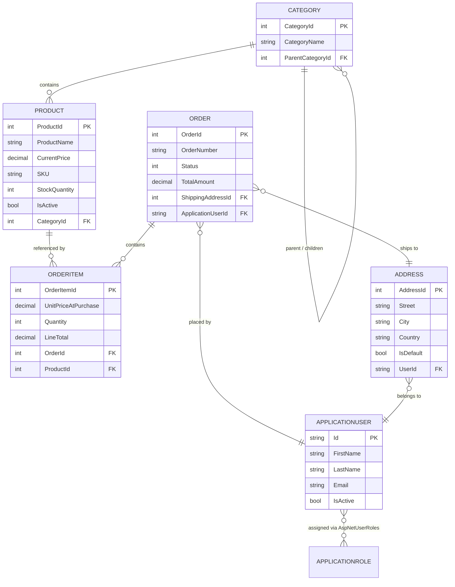

# ShopHub — MiniECommerce

A full-stack e-commerce platform built with **ASP.NET Core 8 MVC**, featuring a customer storefront and a separate admin management panel, layered on a clean **Repository → Unit of Work → Service → Controller** architecture.

> Repository name: `MiniECommerce` · Storefront brand: **ShopHub**

---

## Table of Contents

- [Overview](#overview)
- [Features](#features)
- [Tech Stack](#tech-stack)
- [Architecture](#architecture)
- [Project Structure](#project-structure)
- [Domain Model](#domain-model)
- [Areas & Routing](#areas--routing)
- [Getting Started](#getting-started)
- [Configuration Reference](#configuration-reference)
- [Key Design Decisions](#key-design-decisions)
- [Roadmap / Known Limitations](#roadmap--known-limitations)
- [Contributing](#contributing)
- [License](#license)

---

## Overview

MiniECommerce is a server-rendered MVC storefront split into two isolated **Areas** that share one codebase, one database, and one ASP.NET Core Identity store:

- **Customer Area** — browse/search products, manage a session-based cart, check out, track orders, and manage shipping addresses.
- **Admin Area** — manage the product catalog, categories, orders, staff roles, and view store-wide KPIs from a dashboard.

Authorization is role-based (`Admin`, `Customer`), and the app intelligently redirects unauthenticated or unauthorized users to the correct area-specific login/access-denied page.

---

## Features

### Customer-Facing
- Product catalog with pagination, category filters, and keyword/price search
- Product details page with live stock status
- Session-backed shopping cart (AJAX add/update/remove, no page reloads)
- Multi-step checkout with saved shipping addresses
- Transactional order placement with stock validation and rollback on failure
- Order history and per-order details
- Address book (create, edit, delete, set default)
- Self-registration and login

### Admin Panel
- Dashboard with KPIs: total/active products, total orders, pending orders, customer count, and revenue
- Recent orders + low-stock alerts widgets
- Product management: create/edit/delete, image upload with validation, auto-generated SKUs, pagination
- Category management with parent/child hierarchy
- Order management: expandable rows with shipped items, inline AJAX status updates
- Role management: create/edit/delete roles with a selectable icon
- Admin account creation restricted to existing admins
- **Storefront preview mode** — admins can browse the live catalog exactly as customers see it, with purchase actions swapped for management shortcuts

---

## Tech Stack

| Layer            | Technology                                              |
|-------------------|----------------------------------------------------------|
| Framework          | ASP.NET Core 8.0 MVC (Areas)                             |
| ORM                | Entity Framework Core 8.0.25 (Code-First + Migrations)   |
| Database            | SQL Server                                               |
| Auth                | ASP.NET Core Identity (custom `ApplicationUser` / `ApplicationRole`) |
| Frontend            | Razor Views, Bootstrap 5, Font Awesome, jQuery + jQuery Unobtrusive Validation |
| State                | Session-based cart (JSON-serialized into `ISession`)     |

---

## Architecture

The app follows a strict top-down layering so controllers never talk to `DbContext` directly:

```
┌──────────────────────────────────────────────────────────────┐
│                        Presentation                            │
│  Razor Views (Areas: Admin / Customer) — Bootstrap + jQuery    │
│  Controllers → ViewModels / DTOs (no domain entities in forms) │
└───────────────────────────┬──────────────────────────────────┘
                             │
┌───────────────────────────▼──────────────────────────────────┐
│                        Service Layer                           │
│  IProductService · ICategoryService · IOrderService            │
│  IOrderItemService · IAddressService                            │
│  CartService (session)  ·  CheckoutService (orchestration)      │
└───────────────────────────┬──────────────────────────────────┘
                             │
┌───────────────────────────▼──────────────────────────────────┐
│                Repository / Unit of Work                       │
│  IRepository<T> generic CRUD + entity-specific repositories     │
│  IUnitOfWork → SaveChanges / BeginTransaction                   │
└───────────────────────────┬──────────────────────────────────┘
                             │
┌───────────────────────────▼──────────────────────────────────┐
│                    Data Access — EF Core 8                     │
│         ApplicationDbContext : IdentityDbContext<...>          │
└───────────────────────────┬──────────────────────────────────┘
                             │
                    ┌────────▼────────┐
                    │   SQL Server     │
                    └──────────────────┘
```

**Why this shape:**

- **Repository + Unit of Work** — `Repository<T>` provides generic CRUD (`GetById`, `GetAll`, `Insert`, `Update`, `Delete`) against `DbSet<T>`. Entity-specific repositories (e.g. `IProductRepository`) extend it with specialized, query-shaped methods (pagination, filtering, DTO projection). `IUnitOfWork` owns `SaveChanges`/transactions so no service or controller touches `ApplicationDbContext` directly.
- **Service Layer** — business rules live here, not in controllers: uniqueness checks (SKU, category name, order number), stock validation, image handling, SKU generation, and cart/checkout orchestration.
- **Thin Controllers** — controllers map HTTP → ViewModel → Service call → View/redirect. No LINQ or EF-specific code in controllers.
- **ViewModels & DTOs** — forms bind to purpose-built ViewModels (`ProductCreateViewModel`, `CategoryViewModel`, `CheckoutVM`, …) instead of raw entities; read-heavy admin/customer order views are served by projected DTOs (`OrderDto`) to avoid over-fetching and to decouple the view shape from the EF model.
- **Dependency Injection** — every repository, service, and `IUnitOfWork` is registered as `Scoped` in `Program.cs`, keeping each HTTP request's `DbContext` and its dependents consistent for the lifetime of that request.

---

## Project Structure

```
MiniECommerce/
├── Areas/
│   ├── Admin/
│   │   ├── Controllers/     # Account, Category, Dashboard, Order, Product, Role
│   │   ├── ViewModels/      # Dashboard, Product*, Category*, Order*, Account*
│   │   └── Views/           # Razor views + _AdminLayout + _AdminNavbarPartial
│   └── Customer/
│       ├── Controllers/     # Account, Address, Cart, Catalog, Checkout, Orders
│       ├── ViewModels/      # Catalog, Checkout, Address, Account
│       └── Views/           # Razor views + _CustomerLayout + _CustomerNavbarPartial
├── Controllers/              # HomeController, ErrorController (site-wide)
├── Data/                     # ApplicationDbContext (OnModelCreating, relationships, indexes)
├── DTO/                      # OrderDto, OrderItemDto, OrderList
├── Extensions/                # SessionExtensions (Cart <-> Session JSON)
├── Interfaces/
│   ├── Repositories/          # IRepository<T> + entity repos + IUnitOfWork
│   └── Services/               # IProductService, ICategoryService, IOrderService, ...
├── Migrations/                  # EF Core code-first migrations
├── Models/                       # Product, Category, Order, OrderItem, Address
│   └── IdentityModels/            # ApplicationUser, ApplicationRole
├── Repositories/                  # Repository<T> + entity implementations + UnitOfWork
├── Results/                        # Enums (OrderStatus, StockStatus, ...) + result types
├── Services/                        # ProductService, CategoryService, CartService, CheckoutService, ...
├── Views/                            # Shared root layout, Home views, validation partial
├── wwwroot/                           # css / js / lib / Images (uploaded product photos)
├── GlobalUsing.cs                      # Project-wide `global using` directives
├── Program.cs                          # Composition root: DI, Identity, pipeline, seeding
└── appsettings.json                    # Connection string & logging config
```

---

## Domain Model



**Notable modeling choices:**

- `Category` is **self-referencing** (`ParentCategoryId` → `ParentCategory` / `ChildrenCategories`) to support nested category trees; the parent FK uses `ClientSetNull` to avoid multiple-cascade-path errors in SQL Server.
- `Product.SKU` and `Category.CategoryName` are enforced unique at the database level (`SKU` uses a filtered unique index so multiple `NULL`s are allowed).
- `OrderItem` stores `UnitPriceAtPurchase` and `LineTotal` as a **price snapshot** — historical orders stay accurate even if `Product.CurrentPrice` later changes.
- Most FK relationships use `DeleteBehavior.Restrict` to prevent accidental cascade deletes across orders, users, and products.

---

## Areas & Routing

Routing is configured with an areas-first convention in `Program.cs`:

```csharp
app.MapControllerRoute(
    name: "areas",
    pattern: "{area:exists}/{controller=Home}/{action=Index}/{id?}");

app.MapControllerRoute(
    name: "default",
    pattern: "{controller=Home}/{action=Index}/{id?}");
```

| Path                                   | Description                          |
|------------------------------------------|----------------------------------------|
| `/`                                        | Public landing page                     |
| `/Customer/Catalog`                        | Product browsing, search, filters       |
| `/Customer/Cart`                            | Session cart                            |
| `/Customer/Checkout`                         | Address selection & order placement     |
| `/Customer/Orders`                            | Order history for the logged-in user    |
| `/Customer/Account/Login` / `Register`         | Customer authentication                 |
| `/Admin/Account/AdminLogin`                      | Admin authentication                    |
| `/Admin/Dashboard`                                | KPI dashboard                          |
| `/Admin/Product` / `/Admin/Category` / `/Admin/Order` / `/Admin/Role` | Store management |

Unauthenticated requests and access-denied cases are redirected to the **correct area's** login/access-denied page automatically, based on the requested route's `area` value (`ConfigureApplicationCookie` events in `Program.cs`).

---

## Getting Started

### Prerequisites
- [.NET 8 SDK](https://dotnet.microsoft.com/download)
- SQL Server (LocalDB, Express, or full instance)
- `dotnet-ef` tool: `dotnet tool install --global dotnet-ef`

### 1. Clone & restore
```bash
git clone <repo-url>
cd MiniECommerce
dotnet restore
```

### 2. Configure the connection string
`appsettings.json` ships with a LocalDB-friendly default:
```json
"ConnectionStrings": {
  "ConnectionString": "Server=.;Database=E-Commerce;Trusted_Connection=True;TrustServerCertificate=True;"
}
```
Update the `Server=` value to match your SQL Server instance if needed.

### 3. Configure the seed admin (user secrets)
On first run, `Program.cs` seeds the `Admin`/`Customer` roles and one admin account from configuration. These values are **not** committed to `appsettings.json` — set them via user secrets:
```bash
dotnet user-secrets init
dotnet user-secrets set "SeedAdmin:Email" "admin@shophub.com"
dotnet user-secrets set "SeedAdmin:Password" "YourStrongP@ssw0rd!"
```

### 4. Apply migrations
```bash
dotnet ef database update
```

### 5. Run
```bash
dotnet run
```
The app launches (per `launchSettings.json`) at `https://localhost:7059` / `http://localhost:5075`. Uploaded product images are written to `wwwroot/Images` at runtime (created automatically if missing).

---

## Configuration Reference

| Key                              | Purpose                                                       |
|------------------------------------|------------------------------------------------------------------|
| `ConnectionStrings:ConnectionString` | SQL Server connection string                                   |
| `SeedAdmin:Email` *(user secret)*    | Email for the auto-seeded initial admin account                |
| `SeedAdmin:Password` *(user secret)* | Password for the auto-seeded initial admin account              |
| `Logging:LogLevel`                    | Standard ASP.NET Core logging configuration                    |

**Identity policy** (configured in `Program.cs`):
- Password: min. 8 chars, requires uppercase, lowercase, digit, non-alphanumeric, 4 unique characters
- Lockout: 5 failed attempts → 5-minute lockout
- Cookie: `HttpOnly`, `SameSite=Lax`, 7-day expiration

---

## Key Design Decisions

- **Session-based cart, no `Cart` table** — the cart is a `Dictionary<int, CartItem>` serialized to JSON and stored in `ISession` (`SessionExtensions`). It's only materialized into `Order`/`OrderItem` rows at checkout, keeping guest-friendly, low-overhead cart state.
- **Transactional checkout** — `CheckoutService` re-validates product availability/stock against the database, opens an EF Core transaction, creates the `Order` + `OrderItem`s, decrements stock, commits, and only then clears the cart. Any exception triggers a full rollback.
- **SKU auto-generation** — `ProductService.GenerateUniqueSKU` builds a readable SKU from category and product name fragments plus a random numeric suffix; uniqueness is double-enforced at the service layer (`CheckUniquness`) and via a filtered unique index in the database.
- **DTO projection at the query level** — `OrderRepository` uses a single reusable `Expression<Func<Order, OrderDto>>` projection so both admin ("all orders") and customer ("my orders") queries translate to efficient, shape-matched SQL instead of loading full entity graphs.
- **One catalog UI, two roles** — the Customer catalog/detail views detect `User.IsInRole("Admin")` and swap "Add to Cart" for management shortcuts, so store managers can preview the live storefront without a separate read-only view.
- **Area-aware auth redirects** — a single `ConfigureApplicationCookie` reads the current route's `area` to decide whether to redirect to `/Admin/Account/AdminLogin` or `/Customer/Account/Login`, keeping one Identity pipeline for two distinct login experiences.

---

## Roadmap / Known Limitations

This is an actively developed learning/portfolio project. Known gaps at the current stage:

- [ ] No automated unit/integration test suite yet
- [ ] Password reset & email confirmation flows are not wired up (token providers are configured, but no UI/email sender exists)
- [ ] No real payment gateway — checkout places the order directly without a payment step
- [ ] No product reviews/ratings
- [ ] Global error handling is minimal (`ErrorController` only exposes a 404 page; no structured exception middleware)
- [ ] No output caching for catalog/category data
- [ ] No JSON/REST API surface (the app is fully server-rendered MVC)

Contributions and PRs addressing any of the above are welcome — see below.

---

## Contributing

1. Fork the repo and create a feature branch: `git checkout -b feature/your-feature`
2. Keep controllers thin — put new business logic in a `Service`, new queries in a `Repository`
3. Add/update EF Core migrations for any model changes: `dotnet ef migrations add <Name>`
4. Open a pull request describing the change and its motivation

---

## License

No license file is currently included in this repository. Add one (e.g. MIT) before distributing or accepting external contributions.
